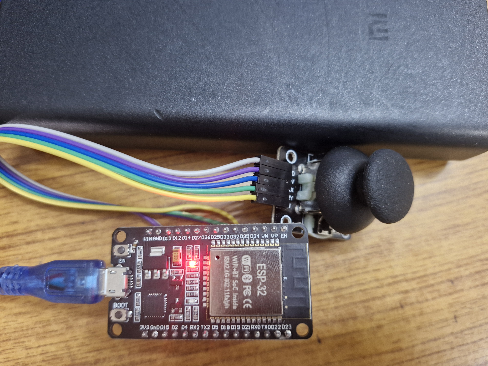
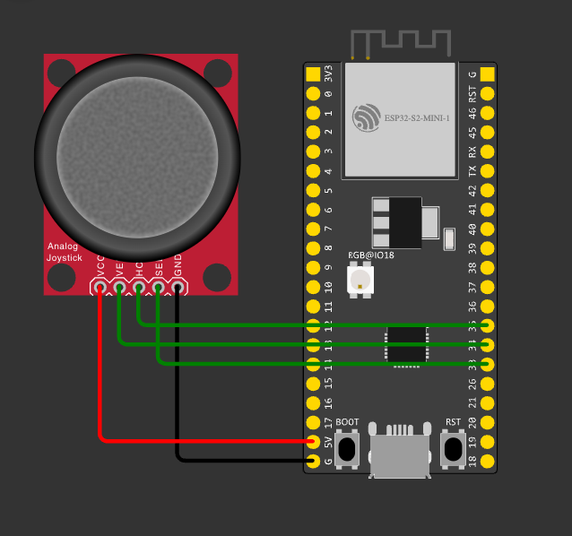

<<<<<<< HEAD
# 🎮 ESP32 Bluetooth Joystick for Mobile Snake Game

This project turns an ESP32 into a Bluetooth joystick (HID keyboard) to control Snake and other mobile games wirelessly.

## 🚀 Features
- Bluetooth HID (works with Android, iOS, Windows, Mac)
- Joystick controls for Up / Down / Left / Right
- Middle joystick button mapped to ENTER
- Wireless controller

## 🧰 Components Used
- ESP32 Dev Board  
- Joystick Module (KY-023)  
- Jumper wires  
- Breadboard  

## 🔌 Wiring

| Joystick Pin | ESP32 Pin |
|-------------|-----------|
| VCC | 3.3V |
| GND | GND |
| VRx | GPIO 34 |
| VRy | GPIO 35 |
| SW  | GPIO 32 |

(Add wiring image here)

## 📲 How to Use

1. Flash the code using PlatformIO  
2. Pair ESP32 with your phone via Bluetooth  
3. Open any Snake game  
4. Control the game using the joystick  

## 🛠 Future Improvements
- Battery powered version  
- 3D printed case  
- Full gamepad HID support  

## 🔌 Wiring

## 📊 Circuit Diagram

